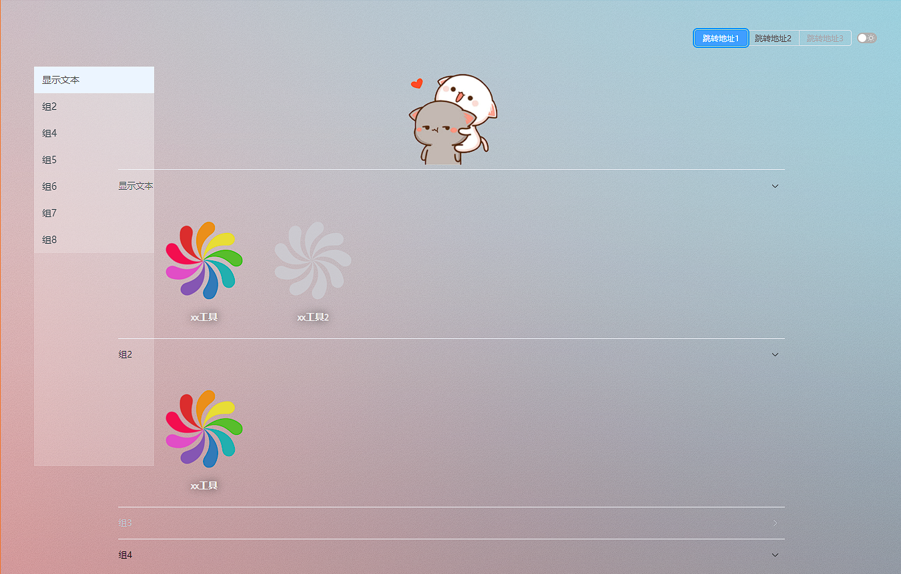

# nav

自定义个人导航页

# 效果图

# 构建

安装 `nodejs`

clone 本项目 `git clone --depth=1 https://github.com/zlyuancn/nav.git && cd nav`

安装依赖包 `npm install`

调试执行 `npm run dev`

编译 `npm run build`

# 通过 docker 构建

安装 `docker`

clone 本项目 `git clone --depth=1 https://github.com/zlyuancn/nav.git && cd nav`

构建 `docker build -t zlyuan/nav .`

运行 `docker run --name=nav -p 8080:8080 zlyuan/nav`

通过 `docker-compose` 运行 `docker compose up -d`

# 配置

配置文件在 `dist/configs` 目录下.

+ [tags.yaml](./public/configs/tags.yaml) 用于配置右上角的标签组, 它控制点击工具时的跳转形式
+ [groups.yaml](./public/configs/groups.yaml) 用于配置工具组和其工具列表
+ [main.yaml](./public/configs/main.yaml) 用于配置 logo 和背景图等
+ [links.yaml](./public/configs/links.yaml) 用于配置右下角的链接

