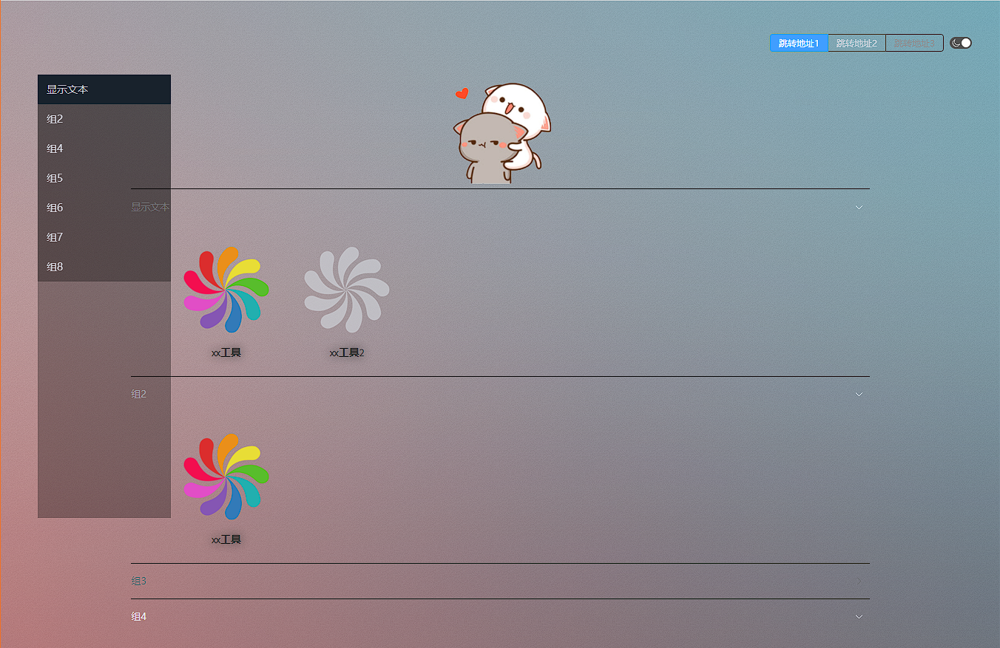

# nav

自定义个人导航页

# 效果图

# 构建

安装 `nodejs`

clone 本项目 `git clone --depth=1 git@github.com:zlyuancn/nav.git && cd nav`

安装依赖包 `npm install`

调试执行 `npm run dev`

编译 `npm run dist`

# 配置

配置文件在 `dist/configs` 目录下.

[tags.yaml](./public/configs/tags.yaml) 用于配置右上角的标签组, 它控制点击工具时的跳转形式
[groups.yaml](dist/configs/groups.yaml) 用于配置工具组和其工具列表
[main.yaml](./public/configs/main.yaml) 用于配置 logo 和背景图等

